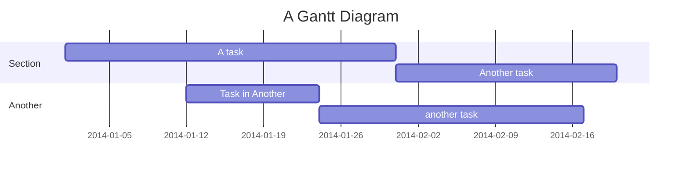

# El titulo del documento

- [El titulo del documento](#el-titulo-del-documento)
  - [Sección 1](#sección-1)
  - [Lista de tareas](#lista-de-tareas)
  - [Tabla](#tabla)
  - [Código](#código)
  - [Enlaces](#enlaces)
  - [Gráficos](#gráficos)

## Sección 1

Lorem ipsum **dolor** sit _amet_, consectetur adipiscing elit. Ut eleifend, eros at **_laoreet accumsan_**, est sapien **_rutrum nulla_**, quis efficitur **enim** turpis vel augue.

In at porta justo, sit amet posuere enim. ~~Donec porttitor mauris sit amet lobortis facilisis.~~ Pellentesque lacinia tempor libero, <u>at porttitor metus</u> vulputate ut.

> code, html, css

## Lista de tareas

- [ ] Tarea 1
- [x] Tarea 2
- [ ] Tarea 3

## Tabla

| id  |  email  | role  |
| :-: | :-----: | :---: |
|  1  | x@x.com | user  |
|  2  | y@y.com | admin |

## Código

```javascript
console.log("Hola Markdown");
```

```shell
npm install nodemon -D
```

```css
body {
  color: red;
}
```

## Enlaces


[Google](https://google.com)

## Gráficos

